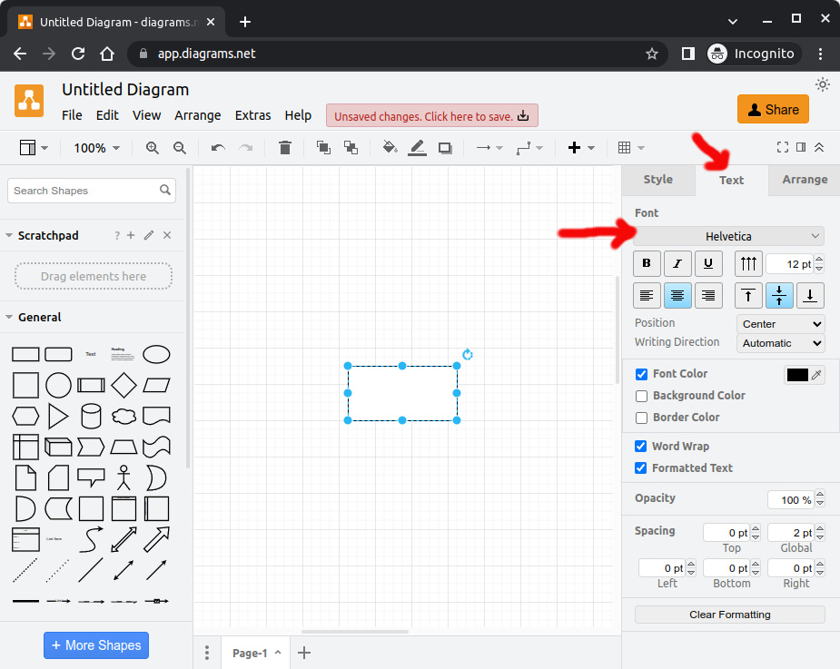
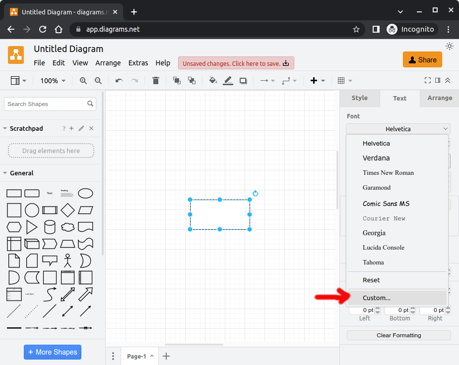
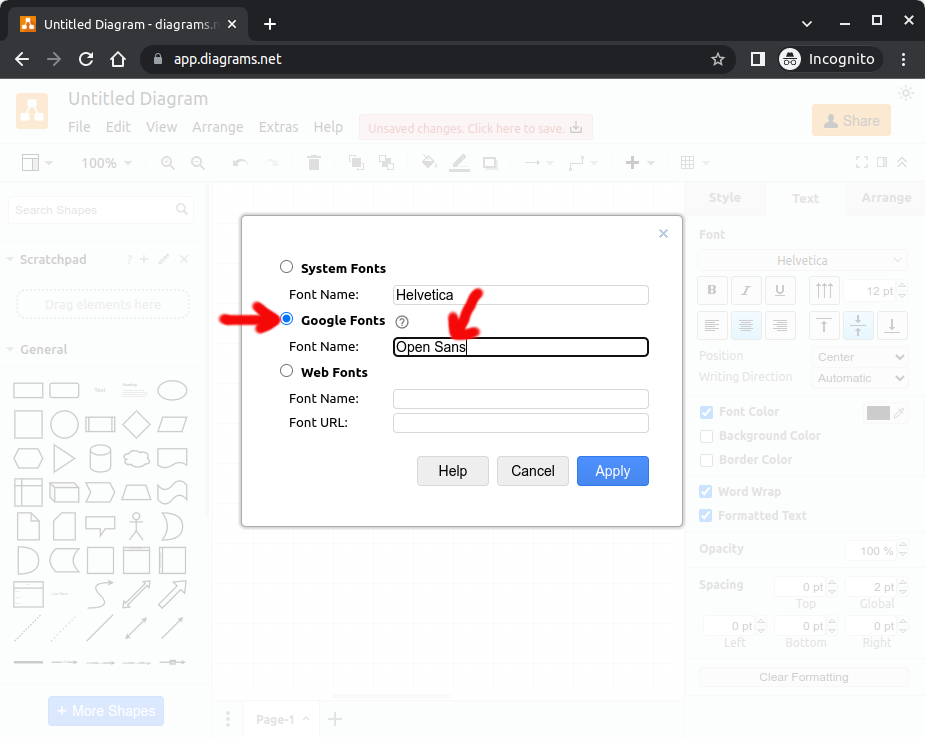
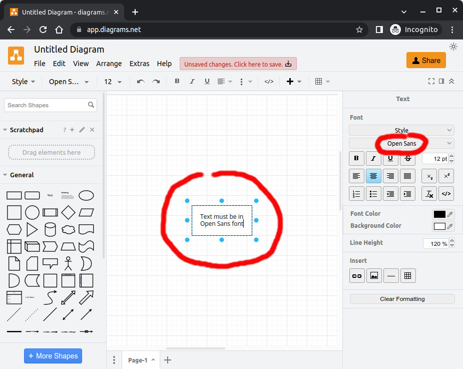

# Contributing to Jakarta EE Documentation

Thanks for your interest in this project.

## Project description

The Eclipse Documentation for Jakarta EE project hosts documentation intended for programmers interested in developing and deploying Jakarta EE applications. It covers the technologies comprising the Jakarta EE platform and describes how to develop applications using Jakarta EE components and deploy them on Jakarta EE runtimes.

Eclipse project page: https://projects.eclipse.org/projects/ee4j.jakartaee-documentation

## Developer resources

The project maintains the following source code repositories

* [eclipse-ee4j/jakartaee-examples](https://github.com/eclipse-ee4j/jakartaee-examples) - Contains examples used in the tutorial (and additional examples)
* [jakartaee/jakartaee-documentation](https://github.com/jakartaee/jakartaee-documentation) - builds documentation site
* [jakartaee/jakartaee-documentation-ui](https://github.com/jakartaee/jakartaee-documentation-ui) - HTML and CSS assets used for the documentation site look and feel.
* 
### Coding guidelines

#### Branches

##### Normal Branches

* Restrict work on a single feature or issue to a single branch
* Branch name: `feature/[issue #]_description_if_necessary`
  * Example: `feature/123_this_is_an_example`
  * Example: `feature/123`
  * Example: `feature/remove_stale_files (no issue number)`

##### Release Branches

* For the main tutorial repo and any other repos with Antora content (that does not include a playbook), we’ll keep a release branch so that we maintain docs for the particular version of Jakarta EE.
* The main branch will represent the current release. All previous releases should have their own branch.
Branch name: `release/[version]`
  * Example: `release/9.1`
  * Example: `release/10`

##### Commits

* Include the issue # in the message (if applicable)
  * Example: “#123 Adds a the ability to synchronize with the example repo”
  * Example: “Updates #123 with changes for pom file”
  * Example: “Removed stale files”

### Creating diagrams

Diagrams are located in `src/main/antora/modules/common/images`.
Use [draw.io](https://draw.io) to create/adjust diagrams.
This tool is primarily chosen for being free to use and the most flexible.
For portability and maintainability, make sure that the diagram is saved/exported into following 3 formats:

- `*.drawio`
- `*.vsdx`
- `*.svg`

The `*.drawio` format ensures being able to reopen exactly the intended diagram in the original tool.
The `*.vsdx` format ensures being able to import the diagram in another tool as this is the most supported format by
various diagramming tools, just in case that draw.io stops to exist in some unpredictable future.
The `*.svg` format is ultimately used to embed the diagram in the tutorial document.

#### Diagram requirements

- Font must be 'Open Sans' conform
  the [Jakarta EE Brand Usage Handbook](https://jakarta.ee/legal/trademark_guidelines/jakarta-ee-branding-guidelines.pdf).
  You can use Google Fonts for this.
  In case you're using draw.io:
    - Wherever you see a 'Font' dropdown, unfold it.
      
    - If there's no 'Open Sans' option, pick 'Custom'.
      
    - Choose the 'Google Fonts' option and set the font name to 'Open Sans' and apply.
      
    - Type text and verify that the font is Open Sans
      

- Color must be one of those defined
  in [Jakarta EE Brand Usage Handbook](https://jakarta.ee/legal/trademark_guidelines/jakarta-ee-branding-guidelines.pdf),
  along with black and white.
    - Primary colors:
        - Blue: `#1B208B`
        - Orange: `#F98200`
        - Black: `#3D3D3D`
        - White: `#FFFFFF`
    - Secondary colors:
        - Yellow: `#FDB940`
        - Grey: `#58595B`
        - Dark blue: `#131660`

### Terminology

| Old | New |
| --- | --- |
| Jakarta Foo Technology | Jakarta Foo API |
| JavaBeans components | beans |
| application server | Jakara runtime |
| (web) container | servlet container | 
| context root | context path |
| web context | application scope |

* Do not use in-house abbreviations! E.g. do not use “DD” but write out fully “deployment descriptor”.
* List items should always start with capital and end with full stop.

## Style guide

If you're going to write documentation, please make sure you follow the [style guide](STYLE_GUIDE.adoc).

## Eclipse Contributor Agreement

Before your contribution can be accepted by the project team contributors must
electronically sign the Eclipse Contributor Agreement (ECA).

* [http://www.eclipse.org/legal/ECA.php](http://www.eclipse.org/legal/ECA.php)

Commits that are provided by non-committers must have a Signed-off-by field in
the footer indicating that the author is aware of the terms by which the
contribution has been provided to the project. The non-committer must
additionally have an Eclipse Foundation account and must have a signed Eclipse
Contributor Agreement (ECA) on file.

For more information, please see the Eclipse Committer Handbook:
[https://www.eclipse.org/projects/handbook/#resources-commit](https://www.eclipse.org/projects/handbook/#resources-commit)

## Contact

Contact the project developers via the project's "dev" list:
https://accounts.eclipse.org/mailing-list/jakartaee-documentation-dev or via the Github issue tracker.
