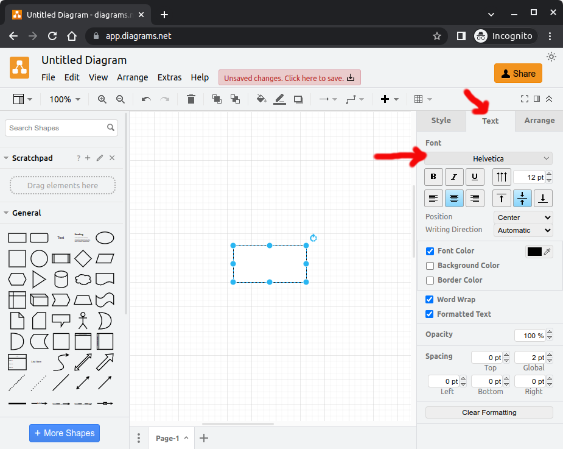
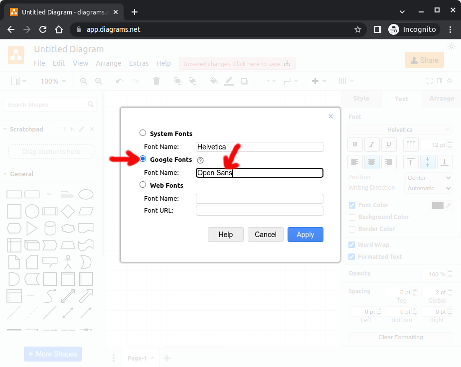

# Jakarta EE Tutorial


This repository contains the source files that are used to build the
_Jakarta Enterprise Edition (Jakarta EE) Tutorial_. The source files
are authored in [AsciiDoc](http://asciidoc.org/).  AsciiDoc is similar
to markdown but is particularly suited for user documentation.  

Note that the Jakarta EE Tutorial code examples are located in a
separate repository
[eclipse-ee4j/jakartaee-tutorial-examples](https://github.com/eclipse-ee4j/jakartaee-tutorial-examples).

## Contributing
The easiest way to contribute is by opening an issue in this project
that contains feedback and review comments.

The Jakarta EE Tutorial project is also open for contributions and your
help is greatly appreciated. If you have an idea for the tutorial and
want to add a section or update an existing section, then review the
following links:

* [Style Guide](STYLE_GUIDE.adoc)
* [Contribute](CONTRIBUTING.md)
* [License](LICENSE.md)

## Building the Jakarta EE Tutorial

The following directions explain how to do local builds of the
tutorial. Note that any changes that are pushed to the master branch
automatically trigger a build of the site files and tutorial sources.
The results are automatically pushed to the gh-pages branch. You can
view the published site
[here](https://eclipse-ee4j.github.io/jakartaee-tutorial).

### Pre-Requisites

- Maven
- JDK8+

Note that manually deploying the site requires password-less
authentication. This is done by exporting your SSH public key into your
GitHub account.

### Build the Site Locally

The site is generated under `target/staging`. Open
`file:///PATH_TO_PROJECT_DIR/target/staging` in a browser to view the
output.

```
mvn generate-resources
```

### Creating diagrams

Diagrams are located in `src/main/asciidoc/images`.
Use [draw.io](https://draw.io) to create/adjust diagrams.
This tool is primarily chosen for being free to use and the most flexible.
For portability and maintainability, make sure that the diagram is saved/exported into following 3 formats:
- `*.drawio`
- `*.vsdx`
- `*.svg`

The `*.drawio` format ensures being able to reopen exactly the intended diagram in the original tool.
The `*.vsdx` format ensures being able to import the diagram in another tool as this is the most supported format by various diagramming tools, just in case that draw.io stops to exist in some unpredictable future.
The `*.svg` format is ultimately used to embed the diagram in the tutorial document.

#### Diagram requirements

- Font must be 'Open Sans' conform the [Jakarta EE Brand Usage Handbook](https://jakarta.ee/legal/trademark_guidelines/jakarta-ee-branding-guidelines.pdf).
  You can use Google Fonts for this.
  In case you're using draw.io:
    - Wherever you see a 'Font' dropdown, unfold it.
        
    - If there's no 'Open Sans' option, pick 'Custom'.
        
    - Choose the 'Google Fonts' option and set the font name to 'Open Sans' and apply.
        
    - Type text and verify that the font is Open Sans
        

- Color must be one of those defined in [Jakarta EE Brand Usage Handbook](https://jakarta.ee/legal/trademark_guidelines/jakarta-ee-branding-guidelines.pdf), along with black and white.
    - Primary colors:
        - Blue: `#1B208B`
        - Orange: `#F98200`
        - Black: `#3D3D3D`
        - White: `#FFFFFF`
    - Secondary colors:
        - Yellow: `#FDB940`
        - Grey: `#58595B`
        - Dark blue: `#131660`


### Deploy the Site to Github Pages

If you want to manually push a build to the gh-pages branch, use:

```
mvn deploy -Ppublish-site
```
Never commit changes to the *gh-pages* branch directly.

### Produce a Zip File for Download

To produce a zip file containing the generated HTML files, use:

```
mvn package
```

When making a release on GitHub, this zip file should be added to the release.

## Links

- [Asciidoctor Maven Plugin](https://asciidoctor.org/docs/asciidoctor-maven-plugin/)

- [AsciiDoc User Guide](http://asciidoc.org/userguide.html)

- [Asciidoctor quick reference](http://asciidoctor.org/docs/asciidoc-syntax-quick-reference)
